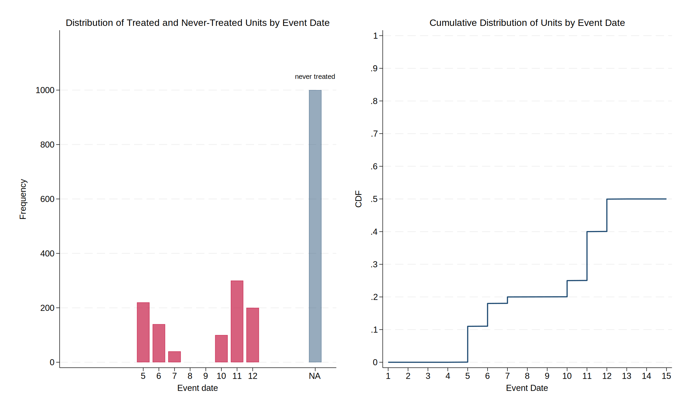
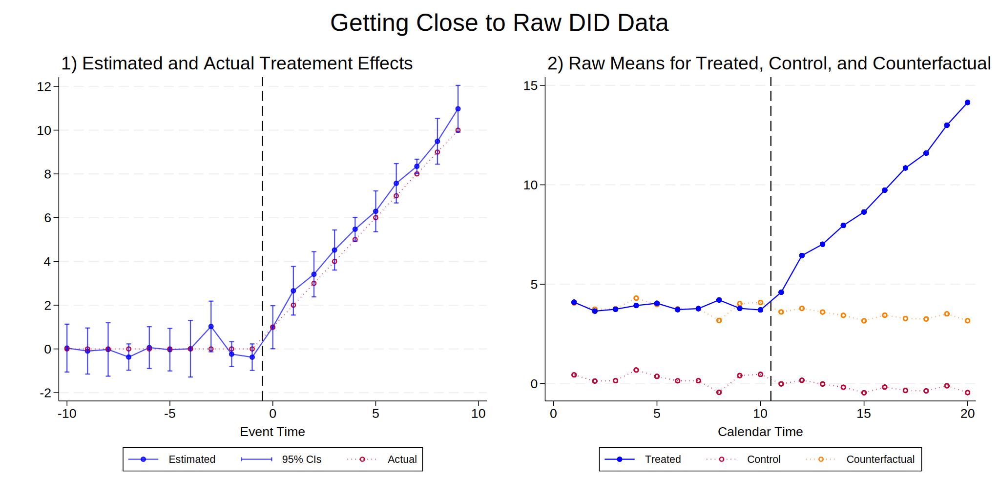
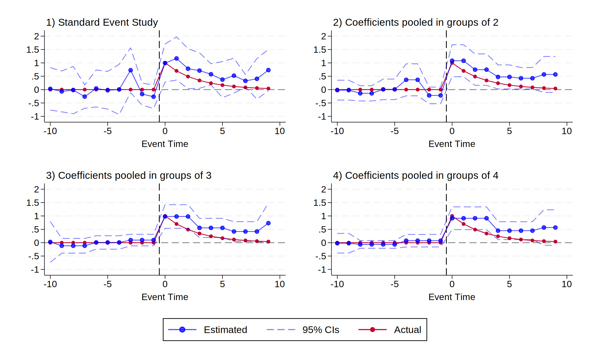
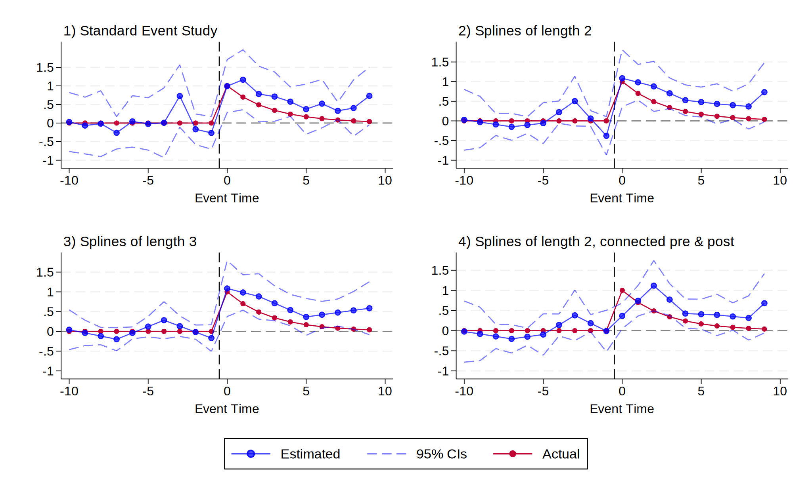
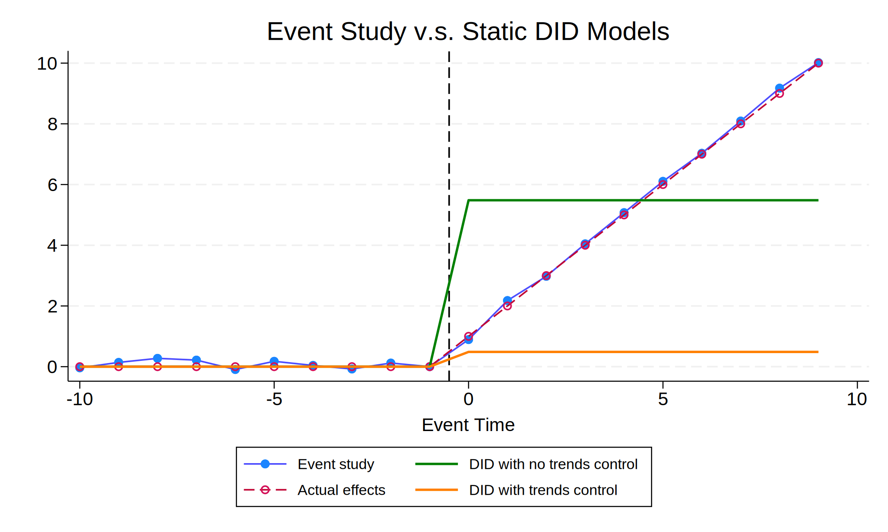

# Event Study
One question had confused me for a long time: What are differenrences between **event study (ES)** and **difference-in-differences (DID)**? Are they just different names for the same item? Here, I share my recently improved understanding of event study, including a comparison between it and the standard static DID. Most ideas in this repository are summarized from [Miller (2023)](https://doi.org/10.1257/jep.37.2.203) and [Schmidheiny & Siegloch (2023)](https://doi.org/10.1002/jae.2971).

## What Is Event Study?
Event study is nowadays a popular approach to estimating dynamic treatment effects. Like DID, one of its appealing features is that it can easily visualize the estimated results (by line or scatter plots). The event study approach is usually applied to panel data, and its standard estimating equation is
$$Y_{it} = \left(\sum_{j \in \\{-m, ..., 0, ..., n\\}} \gamma_j D_{i,t-j}\right) + \alpha_i + \delta_t + \beta X_{it} + \epsilon_{it}$$
where
  * $Y_{it}$ is outcome variable.
  * $j$ indexes the **event time** (or called **relative time**). For example, $j=0$ denotes the period when the event took place, $j=-1$ denotes the last period before the occurrence of the event, and $j=1$ denotes the next period following the occurrence of the event. The pre-set constants $m$ and $n$ denote the endpoints for the estimated event study terms.
  * $D_{i,t-j}$ is a **dummy variable** for event time $j$.
  * $\gamma_j$'s are our coefficients of interest. $\gamma_j$ for $j\geq0$ capture the dynamic treatment effects we are estimating, and $\gamma_j$ for $j<0$ work for a placebo test.
  * $\alpha_i$ and $\delta_t$ are unit and time fixed effects, respectively.
  * $X_{it}$ are optional control variables.

From the visualization of their returned results, it’s easy to see the difference among time series, event study, and difference-in-differences.
  * Time series models (e.g., autoregressive processes and moving average processes) use the **calendar time** as the *x*-axis in their figures, but event study models use the **event time** (period relative to the calendar time of the occurrence of the event).
  * Standard DID models (i.e., a static DID) restrict the pre-treatment coefficients to be **zero** and restrict the post-treatment coefficients to be **constant**; thus, a figure showing standard DID results looks like a plot of a step function. By contrast, event study models allow for **varying post-treatment coefficients** over event time.

## Data for Event Study
To determine what data structure a dataset has, we just need to answer two questions:
  1. Are there never-treated units?
  2. Are there lots of variations in the event dates across units?

[Miller (2023)](https://doi.org/10.1257/jep.37.2.203) summarizes the possible data structures (based on the answers to the two questions above) in the following table.
| | Only Ever-Treated | Never-Treated Units Exist |
| --- | :---: | :---: |
| **Common Event Date** | N/A | DID-type |
| **Varying Event Date** | Timing-based | Hybrid |

The timing-based and hybrid data structures are closely related to the nowadays frequently investigated topic in DID literature: DID in **staggered treatment design**.

Without understanding the data structure, it's impossible to apply a convincible econometric model.[^1] Therefore, [Miller (2023)](https://doi.org/10.1257/jep.37.2.203) suggest that researchers should explicitly tell readers the data structure. There are two simple ways to show the data structure (in particular, the common/varying event date): a frequency histogram (like a probability mass function) and a distribution line graph (i.e., a cumulative distribution function). An example for hybrid data structure ([coding](./Coding/FA2_Distribution.do)) are shown below.

[^1]: Not once or twice, I found some Econ students ran bunches of event study or DID regressions without knowing in advance their data structures.

[Miller (2023)](https://doi.org/10.1257/jep.37.2.203) additionally encourages the illustrations that are close to the raw data. In particular, except for the plot showing estimation results, we had better visualize (in main text or appendix) the raw means for treated, control, and counterfactual outcomes. This visualization can help readers immediately know the origin of the estimated treatment effects. An example for DID-type data ([coding](./Coding/FA7_Raw_DID_Data.do)) is shown below. Examples for timing-based data ([coding](./Coding/FA8_Raw_Timing_Data.do)) and DID-type data with trends ([coding](./Coding/FA14_Raw_DID_Data_with_Trends.do)) are also generated but not shown here for saving space.

## Multicollinearities Challenges of Event Study
To define the treatment effects, we need to select a **reference period** (as a counterfactual). The most common counterfactual normalization is normalizing the coefficient $\gamma_{-1}$ to be zero, simply by excluding the dummy variable for $j=-1$ from the model. The risk of this strategy arises from extra statistical noise brought by using only one reference period. Thus, it may be desirable to use a longer pre-event period in certain contexts. In general, using a longer reference period shifts up/down the whole pattern of event-time coefficients and leads to narrower confidence intervals.

Something important is that when using a longer reference period, we should **assess the overall trend in coefficients** rather than examine whether coefficients are significantly different from zero. An example ([coding](./Coding/FA5_Pre-Trends.do)) is provided below, where a systematic time trend for treated units is added. Clearly, regardless of the counterfactual normalizations, we can see a steady downward trend in the coefficients. However, the whole curve shifts down when we use all pre-treatment periods as reference; thus, in this case, if we keep using the significance of pre-event coefficients to do the assessment, we may mistakenly reject the existence of a trend.

More multicollinearities can be found between panel fixed effects and even-time dummies. The sum of the unit dummies is equal to one, and the sum of the calendar-time dummies is equal to one. Thus, there is a multicollinearity between these two sets of dummies as well as the intercept. Typically we drop one from each set. In addition, there is a multicollinearity between the event-time dummies $D_{i,t-j}$ and the unit and calendar-time dummies.

Anyway, with a model in which multicollinearities abound, we must add some restrictions on the parameters to proceed. To learn details about multicollinearities in event study models, [Miller (2023)](https://doi.org/10.1257/jep.37.2.203) recommends a Stata built-in command: `cnsreg`.
  * When using this command, we have to manually specify the parameter restrictions through the `constraints( )` option.
  * With the `collinear` option, the command doesn't drop collinear terms automatically, so we have to screen out those terms by ourselves. By contrast, many other Stata command (e.g., `reghdfe`) omit the multicollinear terms automatically.
  * Using the no-base factor notions `ibn.i` and `ibn.t`, we require the Stata not omit any unit or calendar-time dummy.

`cnsreg` may be poor in convenience, but it is a good tool for us to learn about the multicollinearities in our regressions. Why should we know these multicollinearities and corresponding parameter restrictions? In response to this question, I cited a sentence from [Miller (2023)](https://doi.org/10.1257/jep.37.2.203): "These are not merely formalities --- the treatment effect coefficients $\gamma_j$ we estimate are directly dependent on the restrictions imposed." If we are not clear about the constraints we (or Stata) impose, how can we be sure that a significant estimate reveals the true effect or just comes from a specific constraint?

## Pooling Together Coefficients
Sometimes an event study model has too wide confidence intervals around coefficients of interest. One way to improve statistical power is to pool together event study coefficients. Two methods are available:
  * **Pooling:** We use one dummy to represent two or more adjacent event-time and then include these pooled dummy variables in the model. Equivalently, we can run a constrained regression with constraints such as $\gamma_{-10} = \gamma_{-9}$, $\gamma_{-8} = \gamma_{-7}$, and so forth.
  * **Spline:** We impose “no concavity” constraints on the event-time coefficients. The linear piecewise spline has a form like $\gamma_{-3} - \gamma_{-2} = \gamma_{-2} - \gamma_{-1}$; that is, these coefficients are forced to lie on a connected set of straight lines. When we are using the spline, a question needs consideration: Should we allow for a break between the pre-event and post-event coefficients?

Examples for different pooling lengths ([coding](./Coding/FA9_Pooling.do)) and spline lengths ([coding](./Coding/FA10_Splines.do)) are shown below. Sadly, in the case where the actual effects have a jump-and-then-decay pattern, neither method returns a satisfactory result.

  <strong>Example: Pooling Event Study Coefficients</strong>
  

  <strong>Example: Splines in Event Study Coefficients</strong>
  

## Controlling for Trends
Trends usually appear in event study models in two ways:
  1. Treated unit types follow a different trend from untreated unit types in terms of their untreated potential outcomes.
  2. Treatment effects themselves are trending in time since treatment.

Here I list two recommendations from [Miller (2023)](https://doi.org/10.1257/jep.37.2.203):
  * Constrain the trend in the **reference-period coefficients** to be zero.
  * Focus on **unit-type trends**, rather than unit-specific trends; that is, allow for one shared trend parameter for each group of units that share an event date.

As [Miller (2023)](https://doi.org/10.1257/jep.37.2.203)'s trials show, these two strategies return good results when the dataset has a DID-type structure, but they do badly when the dataset is timing-based (i.e., when no never-treated units exist).

## A Simple Comparison between Event Study and Static TWFE DID
As [Sun & Abraham (2021)](https://doi.org/10.1016/j.jeconom.2020.09.006) proved, if treatment effects vary across event time (i.e., $\gamma_j$ changes with $j$), then the estimates from a static TWFE model will be biased. By contrast, the event study model intuitively may return less biased estimates since it allows for the event-time-variant treatment effects. An example ([coding](./Coding/FA16_ES_vs_StaticDID.do)) is shown below, where the DID estimates (with and without a trend control) are crazily biased.

